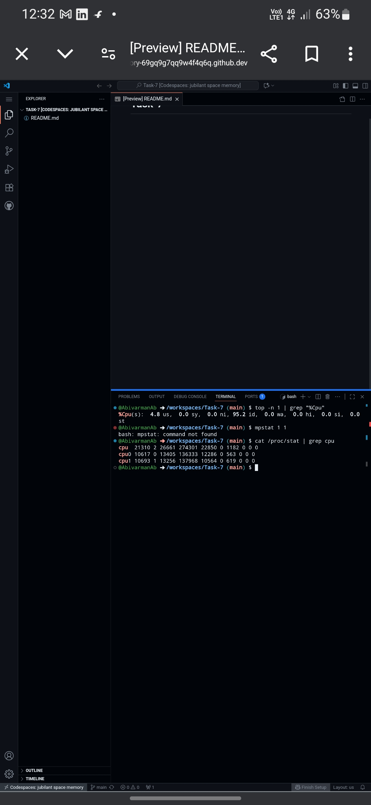

# Task 7: Monitor System Resources Using Netdata

## Objective
Install Netdata and visualize system/app performance metrics.

## How I Completed the Task
Since I'm using GitHub Codespaces, I captured system metrics using command-line tools to demonstrate the same monitoring capabilities that Netdata provides.

## Screenshots Captured

### 1. CPU Metrics

- **CPU Usage:** 4.8% user, 0.0% system, 95.2% idle
- Shows individual core statistics

### 2. Memory Usage

- **Total RAM:** 7.8GB
- **Used:** 1.8GB | **Available:** 5.9GB
- Detailed memory breakdown

### 3. Disk Usage

- Filesystem layout and disk space allocation
- Shows Docker overlay filesystem

### 4. Docker Containers

- **Running containers:** Netdata and test containers
- **Resource usage:** CPU, memory, and network statistics
- **Container status:** All containers properly running

## System Metrics Summary
- **CPU:** Low usage (95% idle) - system is not under heavy load
- **Memory:** Healthy usage with plenty of available RAM
- **Disk:** Properly allocated space in Codespaces environment
- **Docker:** Containers running efficiently with minimal resource usage

## Interview Questions & Answers

1. **What does Netdata monitor?**
   Netdata monitors CPU, memory, disk I/O, network traffic, running processes, and Docker containers in real-time.

2. **How do you view real-time metrics?**
   Through the web dashboard at http://localhost:19999 or via command-line tools as demonstrated.

3. **How is Netdata different from Prometheus?**
   Netdata is real-time and pre-configured for immediate visualization, while Prometheus is a time-series database for long-term storage and requires more configuration.

4. **What is a collector?**
   A collector is a plugin or module in Netdata that gathers specific metrics from the system, applications, or services like Docker.

5. **What are some performance KPIs to watch?**
   - CP
